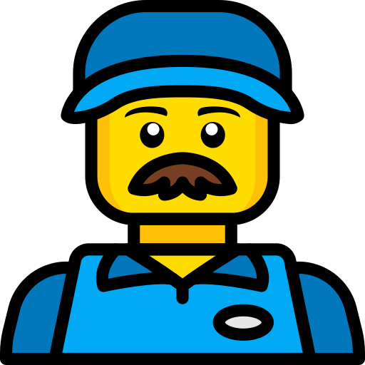

# lego-poc
Proof of concept for Lego Dreamzzz 

[![LinkedIn][linkedin-shield]][linkedin-url]

<h2>Client</h2>

Contract: Engaged

<b>Lego</b>

<!-- PROJECT LOGO -->
 

 

  

<h3 align="center">Lego Dreamzzz Proof of Concept</h3>

  

Augmented reality web based experience for a Lego.
  

 

<!-- ABOUT THE PROJECT -->
## About The Project

 

 
 Although this project was not released, it's an interesting AR portal experience that gave me the opportunty to better explore the concept and create strategies to achieve an immerse experience.

 
  <h3>Challenges</h3
   

Alpha video texturing and performance were the biggest challenges for this project. All characters are set individually using chroma key mp4s and the background as well
   

https://github.com/victorcappa/lego-poc/assets/40408965/3ec549dc-5bd1-4fdb-a137-f6909ad7f94f

(<a href="#top">back to top</a>)

<!-- LICENSE -->
## License

All intellectual property is owned by Lego,

(<a href="#top">back to top</a>)

<!-- CONTACT -->
## Contact

Reach out - <a href = "mailto: victorcappa@imaginar.dev">Victor Cappa</a>
<a href="https://www.linkedin.com/in/victor-cappa-50839788/">Linkedin</a>

(<a href="#top">back to top</a>)

[linkedin-shield]: https://img.shields.io/badge/-LinkedIn-black.svg?style=for-the-badge&logo=linkedin&colorB=555
[linkedin-url]: https://www.linkedin.com/in/victor-cappa-50839788/
